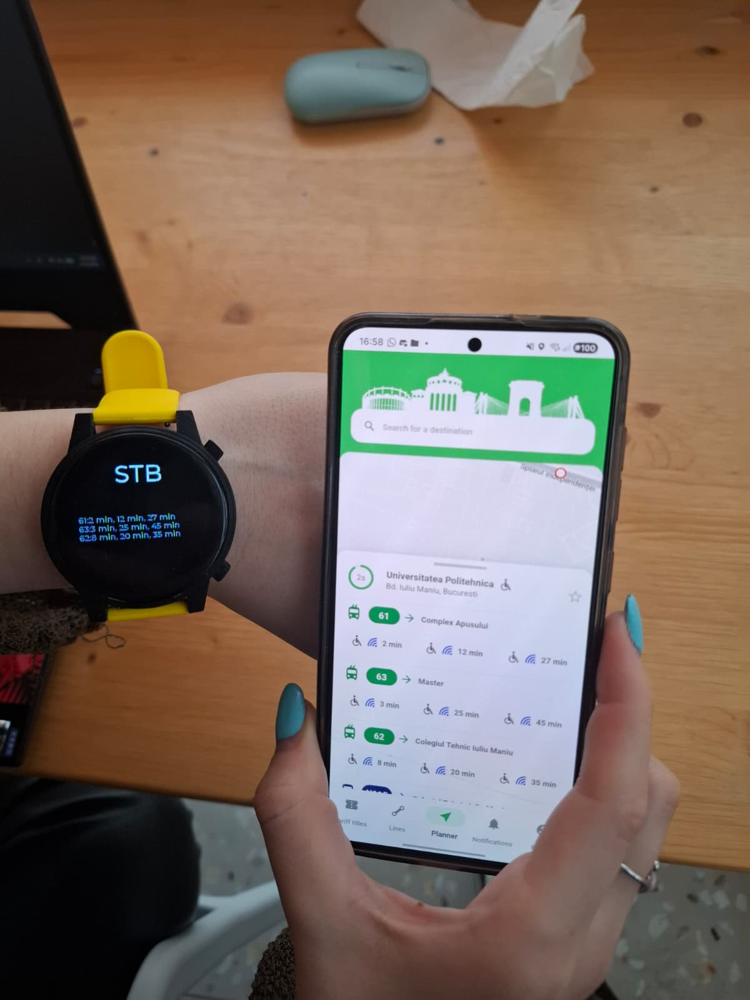
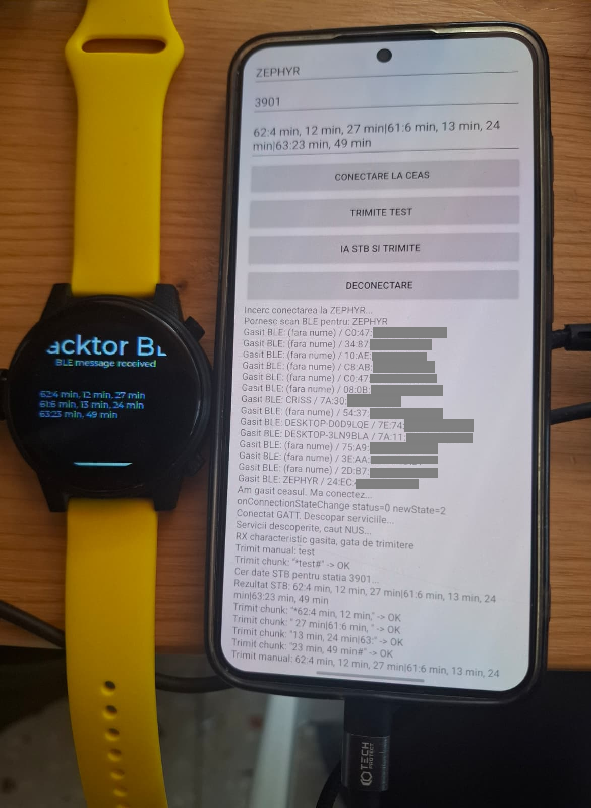

# Real-Time-Transit-Smartwatch
This app has been deployed and developed fully by me during the Open Hack Day organised by ROSEdu- Zephyr OS workshop led by Dan Tudose and Daniel Baluta.
https://ocw.cs.pub.ro/courses/iothings/hackathon?utm_source=luma

<table>
  <tr>
    <td>

## Overview

This repository contains a complete smartwatch-style transport project built around:

- a **Mobile App**
- a **Watch App**

The system uses **Bluetooth Low Energy (BLE)** to connect the phone to the watch.

</td>
    <td>
      
    </td>
  </tr>
</table>
 
The phone is responsible for:
- connecting to the internet
- requesting live STB bus arrival data
- parsing the received response
- sending the formatted result to the watch

The watch is responsible for:
- advertising over BLE
- accepting the incoming BLE data
- reconstructing full messages from BLE chunks
- displaying the bus information on screen

The watch firmware is built with **Zephyr RTOS**, using **BLE** and **LVGL** for the UI.

---

## Repository Structure

```text
.
├── Mobile App/     # Android application
├── Watch App/      # Watch firmware built with Zephyr
├── images/           # tutorial images, screenshots, project assets
└── README.md
```

### What Each Part Does

#### Mobile App
The mobile application runs on Android and acts as the data gateway.

It:
- connects to the watch through BLE
- fetches live STB data
- parses the transport response
- formats the final message
- sends it to the watch periodically or on demand

#### Watch App
The watch application runs on embedded hardware and is built with **Zephyr**.

It:
- advertises as a BLE peripheral
- accepts text payloads from the phone
- parses and formats the received message for display
- shows the bus lines and arrival times on the watch screen

---

## Technologies Used

### Mobile App
- Kotlin
- Android BLE / GATT
- OkHttp
- Android UI

### Watch App
- C
- **Zephyr RTOS**
- BLE
- LVGL
- ESP32-S3 watch board

---

## How the System Works

The communication model is:

```text
STB API -> Mobile App -> BLE -> Watch App -> Watch Screen
```

### Communication Principle

This project uses **BLE** instead of Bluetooth Classic.

That means:
- the **watch** acts as a **BLE peripheral**
- the **phone** acts as a **BLE central**

### BLE Flow

1. The watch starts BLE advertising.
2. The phone scans for the watch.
3. The phone connects to the watch over BLE.
4. The phone discovers the BLE service and characteristics.
5. The phone sends the bus arrival data to the watch.
6. The watch receives the chunks, rebuilds the full message, and updates the UI.

### Why BLE Was Used

BLE was chosen because:
- it is appropriate for smartwatch-style communication
- it is lightweight
- it works well for short text messages
- it allows the phone to act as the smart network gateway while the watch remains simple

---

## Mobile App

The mobile app handles the full transport data flow.

### Responsibilities
- BLE scan and connection
- STB authentication
- stop lookup
- response parsing
- message formatting
- automatic periodic sending to the watch

### Example Output Sent to the Watch

```text
62:18 min|336:5 min, 8 min|N122:12 min
```

The payload is sent through BLE in chunks, then reassembled on the watch.

---

## Watch App

The watch app is the embedded display client.

### Responsibilities
- BLE advertising
- BLE data reception
- chunk reassembly
- message rendering
- LVGL screen updates

### Display Behavior
The watch:
- waits for BLE data from the phone
- reconstructs complete messages
- splits lines for display
- highlights useful information visually
- refreshes the screen whenever new data arrives

---

## Why the Phone Connects to the Watch

The phone connects directly to the watch because it is the part that can easily handle:
- internet access
- HTTP requests
- STB authentication
- response parsing
- retry and refresh logic

The watch does not need to talk directly to the internet.  
Instead, it receives already-processed, display-ready information from the phone over BLE.

This keeps the embedded side much simpler and more reliable.

---

## Tutorial

> Add the full setup and usage tutorial here.

Suggested sections:
- toolchain setup
- Zephyr environment setup
- building and flashing the watch app
- building and running the mobile app
- BLE connection steps
- STB testing steps
- troubleshooting

---

## Screenshots

Add screenshots here.

Example:

<p align="center">
  
</p>

---

## Development History

This section can be used to document how the project evolved.

Suggested timeline:

### Phase 1
Basic watch bring-up with Zephyr:
- environment setup
- board build and flash
- display initialization
- simple on-screen output

### Phase 2
Touch and UI work:
- LVGL integration
- custom panel rendering
- screen layout experiments

### Phase 3
BLE communication:
- BLE peripheral setup on the watch
- BLE scan and connection from the phone
- message transfer testing

### Phase 4
Transport integration:
- STB authentication logic
- parsing live arrival data
- formatting results for the watch
- automatic phone-to-watch updates

### Phase 5
UI refinement:
- bus lines rendered clearly
- partial text coloring
- layout cleanup
- continuous refresh behavior

---

## Future Improvements

- selectable stops from the watch UI
- saved favorite stops
- improved background sync on the phone
- reconnection handling
- richer visual design
- icons and route badges
- better payload protocol

## License

This project is licensed under the GNU General Public License v3.0.
